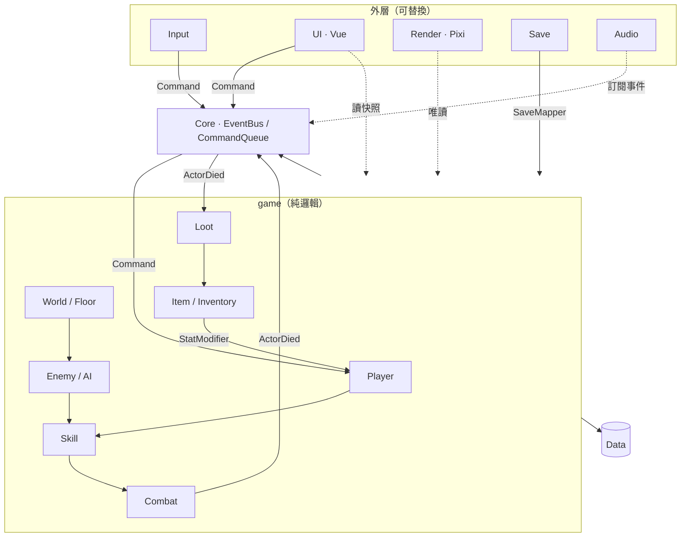

# ARPG Project Architecture（Phase 0）

> 狀態：M0～M4 完成；下一步 M5 Loot。
> 目標：先定義模組邊界、依賴方向、資料格式與 MVP 里程碑，再進入第一個 Vertical Slice。

---

## 0. 技術選型與發佈方式

### 0.1 結論

**TypeScript + Vite + PixiJS（遊戲畫面）+ Vue 3（選單 UI），先發佈 Web 版，之後用 Tauri 包成桌面版上架。**

| 方案 | 優點 | 缺點 | 判斷 |
|---|---|---|---|
| **Web（TS + PixiJS + Vue）** | 你已熟悉 HTML；Claude 寫 TS 最穩；瀏覽器即時測試；純邏輯可用 Vitest 跑單元測試；一份程式碼可發佈到 Web / 桌面 | 需自己組 Game Loop、尋路、深度排序 | **採用** |
| Godot 4 | 內建 TileMap、Navigation、動畫；可匯出 Web / 桌面 | 大量設定存在 `.tscn` 場景檔，Claude 以純文字維護較不穩；你需要學編輯器 | 備案 |
| Unity | 生態完整 | Web 版體積大、C# + 編輯器工作流程，對「用 Claude 從零寫」門檻高 | 不採用 |

分工原則：

- **PixiJS（WebGL）**：地圖、角色、怪物、投射物、粒子。上百個 Sprite 同時移動仍能維持 60 FPS。
- **Vue 3**：技能樹、背包、角色面板、Tooltip、選單。Vue 的 Reactivity 不適合每幀更新數百個物件，所以**只用在面板，不用在戰鬥畫面**。
- **純 TypeScript**：所有遊戲邏輯。不 import DOM / Pixi / Vue，才能在 Node 環境直接測試。

### 0.2 發佈路線

| 階段 | 平台 | 存檔位置 | 說明 |
|---|---|---|---|
| 1. 測試 | GitHub Pages / Cloudflare Pages | 瀏覽器 IndexedDB | 傳一個網址給朋友即可玩 |
| 2. 公開試玩 | itch.io（HTML5 遊戲） | 瀏覽器 IndexedDB + 匯出存檔檔案 | 免費、玩家社群集中 |
| 3. 正式版 | Tauri 包成 Windows / macOS 桌面程式 → Steam | 本機 AppData 檔案 + Steam Cloud | 同一份程式碼，只替換 Storage 實作 |

Tauri 比 Electron 小很多（約 10MB vs 100MB+），且能直接寫本機檔案，存檔可靠度比瀏覽器高。

### 0.3 45 度視角的座標原則

Diablo 2 實際上是 **2:1 等角投影（Dimetric，Tile 64×32）**，不是數學上的 45 度。這是 2D ARPG 的標準做法。

**最重要的規則：遊戲邏輯只使用 World 座標（一般平面直角座標，單位 = Tile），投影只發生在 Render 層。**

```
World (x, y)  ──IsoProjection.toScreen()──►  Screen (sx, sy)
Screen (sx, sy) ──IsoProjection.toWorld()──►  World (x, y)   ← 滑鼠點擊用
```

- 移動、碰撞、距離、技能範圍全部在 World 座標計算，數學單純。
- 深度排序（誰擋住誰）只在 Render 層依 `x + y` 排序。

### 0.4 Game Loop

- 邏輯固定步長 **60 Hz**（`dt = 1/60`），與畫面 FPS 脫鉤，戰鬥結果不受電腦快慢影響。
- Render 以插值平滑顯示。
- 所有隨機使用 **Seeded RNG**，同一個 Seed + 同一串 Command 會得到同一個結果，方便測試與重現 Bug。

---

## 1. 存檔安全設計

「安全」要先分清楚防的是什麼。單機遊戲的存檔在玩家電腦上，**任何放在客戶端的加密金鑰都能被取出**，所以無法真正防止玩家改檔。真正該優先防的是**存檔遺失與損毀**。

### 1.1 威脅與對策

| 風險 | 嚴重度 | 對策 |
|---|---|---|
| 存檔損毀（寫到一半關閉分頁、當機） | 高 | 原子寫入：先寫新紀錄，成功後才切換指標；保留最近 3 份輪替備份 |
| 瀏覽器清除資料 / 儲存空間被回收 | 高 | 使用 IndexedDB + `navigator.storage.persist()`；提供「匯出存檔檔案」；桌面版改存本機檔案 |
| 版本更新後舊存檔讀不進來 | 高 | 存檔帶 `schemaVersion`；每一版寫 Migration（v1→v2→v3）；讀檔時用 Schema 驗證 |
| 資料被部分竄改或讀取錯誤 | 中 | 存檔外層包 SHA-256 Checksum；驗證失敗自動退回上一份備份 |
| 玩家手動改檔作弊 | 低（單機） | 只做輕度混淆 + Checksum，擋住「用記事本改數字」即可，不投入更多 |
| 未來若有排行榜 / 交易 | — | 必須改為 Server-authoritative（見 1.4），客戶端驗證永遠不夠 |

### 1.2 存檔格式原則

1. **只存 ID、數值、狀態**，不存物件、不存 Class 實例、不存函式。
2. **不存可推導的資料**：最終攻擊力、Mastery 是否解鎖，都在讀檔後由規則重新計算。這樣改平衡數值時，舊存檔會自動套用新規則。
3. 物品存「Base ID + 詞綴 ID + 擲骰值」，不存計算後的文字描述。

```ts
// 外層信封
interface SaveEnvelope {
  schemaVersion: number;       // 用於 Migration
  savedAt: string;             // ISO 時間
  checksum: string;            // SHA-256(payload)
  payload: string;             // JSON 字串（可再做輕度編碼）
}

// 內容（v1）
interface SaveDataV1 {
  character: { level: number; xp: number; gold: number };
  skills: {
    learned: Record<SkillId, number>;   // skillId → rank（1～5）
    unspentPoints: number;
    t4UnlockCharges: number;            // 尚未使用的「T4 開通次數」
    t4UnlockedCategories: SkillCategory[]; // 已用開通次數打開的類別（玩家選擇，無法推導，必須存）
    loadout: { left: SkillId; right: [SkillId | null, SkillId | null, SkillId | null]; activeRight: 0 | 1 | 2 };
  };
  inventory: ItemInstance[];
  equipment: Partial<Record<EquipSlot, ItemInstance>>;
  potions: number;
  progress: {
    currentFloor: number;
    highestFloor: number;
    checkpoint: 'stairs' | 'midway';    // 本層最後啟動的存檔點
  };
}

interface ItemInstance {
  uid: string;                 // 唯一 ID
  baseId: string;              // 例：'weapon.short_sword'
  rarity: 'normal' | 'magic' | 'rare' | 'legendary';
  itemLevel: number;
  affixes: { id: string; rolls: number[] }[];
  legendaryId?: string;
}
```

Settings（音量、按鍵）另存一個 Key，不與角色存檔混在一起。

### 1.3 存檔時機與存檔點

每層有兩個存檔點：**樓梯口**（進入樓層時自動啟動）與**中途**（走過去觸碰後啟動）。

存檔分成兩部分處理：

| 資料 | 何時存 | 讀檔後 |
|---|---|---|
| 角色資料（等級、經驗、技能、背包、裝備、補血劑） | 存檔點啟動時、每 60 秒、撿到或裝備物品時、關閉分頁（`visibilitychange` / `pagehide`） | 完整還原 |
| 位置 | 只記錄「第幾層 + 哪個存檔點」 | 從該存檔點出發，本層怪物重新生成 |

角色資料持續自動存，所以關掉遊戲不會損失撿到的裝備；位置只存到存檔點，所以不會出現「讀檔後站在怪物堆裡」的情況。

### 1.4 未來擴充點

`SaveService` 只依賴 `ISaveStorage` 介面：

```
ISaveStorage
├─ IndexedDbStorage   ← Web 版（MVP）
├─ FileStorage        ← Tauri 桌面版
└─ CloudStorage       ← 未來雲端存檔（Supabase / Firebase / Steam Cloud）
```

若未來要排行榜或交易，物品掉落要搬到 Server 端產生。因為 `ItemGenerator` 從第一天就使用 Seeded RNG，Server 可以用同一份程式碼重現結果。

---

## A. Project Folder Structure

```
arpg/
├─ index.html
├─ package.json
├─ vite.config.ts
├─ tsconfig.json
├─ .dependency-cruiser.cjs        # 自動檢查禁止的 import 方向
├─ CLAUDE.md                      # 給 Claude 的架構守則
├─ docs/
│  └─ ARCHITECTURE.md
├─ public/assets/                 # 圖片、音效
├─ src/
│  ├─ main.ts                     # Composition Root：建立所有系統並串接
│  │
│  ├─ core/                       # 無遊戲知識的基礎設施（泛型，不知道有哪些事件 / 指令）
│  │  ├─ GameLoop.ts
│  │  ├─ EventBus.ts
│  │  ├─ CommandQueue.ts
│  │  ├─ Rng.ts
│  │  └─ math/
│  │     ├─ Vec2.ts
│  │     └─ IsoProjection.ts
│  │
│  ├─ data/                       # 純資料 + Schema，不含邏輯
│  │  ├─ schema/                  # Zod Schema（載入時驗證）
│  │  ├─ skills/                  # melee.ts / ranged.ts / magic.ts / support.ts / summon.ts
│  │  ├─ enemies.ts
│  │  ├─ items.ts
│  │  ├─ affixes.ts
│  │  ├─ lootTables.ts
│  │  ├─ floors.ts
│  │  ├─ balance.ts
│  │  └─ DataRegistry.ts
│  │
│  ├─ game/                       # 純遊戲邏輯；禁止 import DOM / Pixi / Vue
│  │  ├─ Commands.ts              # 遊戲接受的 Command 型別（input / ui 可 import）
│  │  ├─ GameEvents.ts            # 遊戲事件型別（M2 起加入）
│  │  ├─ GameWorld.ts
│  │  ├─ entities/                # Actor / Projectile / GroundItem
│  │  ├─ stats/                   # StatBlock / StatModifier
│  │  ├─ player/                  # PlayerController / PlayerLoadout / PotionBelt
│  │  ├─ movement/                # MovementSystem / NavGrid / Pathfinder
│  │  ├─ targeting/               # TargetingService
│  │  ├─ combat/                  # DamagePipeline / DeathSystem / StatusEffectSystem
│  │  ├─ skills/
│  │  │  ├─ SkillSystem.ts
│  │  │  ├─ SkillExecutor.ts
│  │  │  ├─ effects/              # DamageEffect / ProjectileEffect / AreaEffect ...
│  │  │  ├─ modifiers/            # BehaviorModifier（T4 與 Legendary 共用）
│  │  │  ├─ SkillTree.ts
│  │  │  └─ MasteryRule.ts
│  │  ├─ ai/                      # AiSystem / states/
│  │  ├─ enemies/                 # EnemyFactory / AffixApplier
│  │  ├─ summons/                 # SummonSystem
│  │  ├─ world/                   # FloorManager / DifficultyScaler / SpawnSystem
│  │  ├─ items/                   # ItemGenerator / LootSystem / Inventory / Equipment
│  │  └─ progression/             # ExperienceSystem
│  │
│  ├─ input/                      # 滑鼠 / 鍵盤 → Command
│  │  └─ InputManager.ts
│  ├─ render/                     # PixiJS，只讀 GameWorld
│  │  ├─ Renderer.ts
│  │  ├─ Camera.ts
│  │  ├─ views/                   # ActorView / ProjectileView / TileMapView
│  │  └─ vfx/
│  ├─ ui/                         # Vue 3 面板
│  │  ├─ App.vue
│  │  ├─ bridge/GameViewStore.ts  # GameWorld → UI 的唯讀快照
│  │  └─ components/              # Hud / SkillBar / SkillTreePanel / InventoryPanel ...
│  ├─ save/
│  │  ├─ SaveService.ts
│  │  ├─ SaveMapper.ts            # GameWorld ⇄ SaveData
│  │  ├─ migrations/
│  │  └─ storage/                 # ISaveStorage / IndexedDbStorage / FileStorage
│  └─ audio/
│
└─ tests/                         # 對應 src/game 的單元測試
```

---

## B / C / D. 模組責任、核心 Class 與單一職責

### core — 基礎設施

| Class | Single Responsibility |
|---|---|
| `GameLoop` | 以固定步長呼叫 `update(dt)`，以 rAF 呼叫 `render(alpha)` |
| `EventBus<EventMap>` | 型別安全的 publish / subscribe；事件清單由 `game/GameEvents.ts` 定義 |
| `CommandQueue<Command>` | 收集 Input / UI 送來的 Command，於每個 Tick 開頭交給 Game 處理；指令型別由 `game/Commands.ts` 定義 |
| `Rng` | Seeded 亂數（mulberry32），可 fork 出子序列（例如 loot 專用） |
| `IsoProjection` | World ⇄ Screen 座標轉換，純函式 |

### data — 資料層

| Class | Single Responsibility |
|---|---|
| `DataRegistry` | 載入所有 Data、用 Schema 驗證、以 ID 查詢；啟動時若資料錯誤立即報錯 |
| `schema/*` | 定義 SkillDef / EnemyDef / ItemBaseDef / AffixDef / LootTableDef / FloorDef 的結構 |

### game — 遊戲邏輯

| 子模組 | Class | Single Responsibility |
|---|---|---|
| world | `GameWorld` | 持有所有 Entity 與 System，依固定順序執行各 System 的 `update` |
| entities | `Actor` | 玩家 / 怪物 / 召喚物共用的資料結構：位置、陣營、StatBlock、狀態 |
| stats | `StatBlock` | 由 Base 值 + Modifier 清單計算最終屬性（flat → increased% → more%） |
| player | `PlayerController` | 把 Command 轉成玩家意圖：移動、攻擊、施法、喝水；只協調，不計算傷害 |
| player | `PlayerLoadout` | 左鍵技能、右鍵 Q/W/E 三格、目前啟用哪一格 |
| player | `PotionBelt` | 補血劑數量與上限、使用冷卻；一次同時回復 HP 與 MP |
| player | `DeathHandler` | 玩家死亡時把角色送回本層最後啟動的存檔點、補滿狀態 |
| movement | `MovementSystem` | 沿路徑移動 Actor、處理碰撞 |
| movement | `Pathfinder` | 在 `NavGrid` 上做 A* |
| movement | `SeparationSystem` | 角色之間互相推開，避免疊在一起；不會移動的角色只推別人 |
| targeting | `TargetingService` | 回答「這個點附近有沒有可攻擊目標」「範圍內有哪些敵人」 |
| combat | `DamagePipeline` | 所有傷害唯一入口：基礎傷害 → 暴擊 → 防禦（物理）→ 取整 → 扣血 → `ActorDamaged`。命中判定與元素抗性之後加在同一流程，不另建 HitResolver |
| combat | `StatusEffectSystem` | Buff / Debuff 的持續時間、疊層、Tick（燃燒、中毒走 DamagePipeline） |
| combat | `DeathSystem` | 偵測 HP ≤ 0、發出 `ActorDied` 事件、移除 Entity |
| skills | `SkillSystem` | 執行 Actor 的技能意圖：距離外先走過去 → 檢查冷卻 / 魔力 → 施放時間（不能移動）→ 一半時觸發效果。普通攻擊、右鍵技能、怪物攻擊共用 |
| skills | `SkillExecutor` | 依 SkillDef 的 Effect 清單依序執行（含巢狀效果） |
| skills | `EffectRegistry` | `effect.type` → 對應 Effect 實作的對照表；Effect 格式定義在 `data/schema/effects.ts` |
| skills | `ProjectileSystem` | 移動投射物、擊中敵人或撞牆時執行 onHit |
| skills | `ModifierResolver` | 施放前把符合 Tag 的 BehaviorModifier 套到 SkillDef，產生本次實際使用的定義 |
| skills | `SkillTree` | 已學技能與等級（1～5）、點數分配、T4 開通次數；呼叫 `MasteryRule` 判斷能否學 |
| skills | `MasteryRule` | 純函式：給定技能樹狀態與角色等級，判斷某節點能否學 / 升級、某類別能否開通 T4 |
| ai | `AiSystem` | 對每個有 `AiBrain` 的 Actor 執行狀態機（Idle → Chase → Return）。狀態只做決策，追擊與出手交給 SkillSystem |
| enemies | `EnemyFactory` | 由 EnemyDef + Floor 難度 + Affix 組出一隻怪 |
| enemies | `AffixApplier` | 把 Elite Affix 轉成 StatModifier 與行為掛勾 |
| summons | `SummonSystem` | 召喚上限、存活時間；AI 重用 `AiSystem`，只是目標陣營相反 |
| world | `FloorManager` | 目前樓層、進入 / 離開樓層流程 |
| world | `CheckpointSystem` | 每層兩個存檔點（樓梯口 / 中途）的啟動與重生位置 |
| world | `ChestSystem` | 寶箱互動、開啟後交給 LootSystem 產生掉落 |
| world | `DifficultyScaler` | 純函式：Floor → 怪物 HP / 傷害 / 密度 / Elite 機率倍率 |
| world | `SpawnSystem` | 依 FloorDef 產生 SpawnRequest 並交給 EnemyFactory |
| items | `ItemGenerator` | 擲稀有度、Tier、詞綴，產生 `ItemInstance` |
| items | `LootSystem` | 監聽 `ActorDied` 與 `ChestOpened`，查 LootTable，在地上生成物品與補血劑 |
| items | `Inventory` | 物品清單的增刪（MVP 用 List，不做格子） |
| items | `Equipment` | 裝備欄位；穿脫時把詞綴轉成 StatModifier 加到玩家 StatBlock |
| progression | `ExperienceSystem` | 監聽 `ActorDied` 加經驗、判斷升級、給技能點 |

### input / render / ui / save

| Class | Single Responsibility |
|---|---|
| `InputManager` | 監聽 DOM 事件，轉成 Command；不知道任何遊戲規則 |
| `Renderer` | 每幀讀 GameWorld，同步 Pixi Sprite；依 `x + y` 深度排序 |
| `Camera` | 跟隨玩家、提供 Screen ⇄ World 轉換（含鏡頭偏移） |
| `GameViewStore` | 每 100ms 從 GameWorld 產生唯讀快照給 Vue（HP、MP、技能冷卻、背包） |
| `SaveService` | 存 / 讀 / 備份輪替 / Checksum 驗證 / Migration |
| `SaveMapper` | GameWorld ⇄ SaveData 的轉換，唯一知道兩邊格式的地方 |

---

## E. Dependency Direction

```
            main.ts（Composition Root，唯一可以 import 全部的地方）
                 │
   ┌─────────┬───┴─────┬──────────┬─────────┐
   ▼         ▼         ▼          ▼         ▼
 input      ui       render      save     audio
   │         │         │          │         │
   │ Command │ Command │ 唯讀     │ 讀寫    │ 監聽 Event
   │         │ + 快照  │          │ via Mapper
   └────┬────┴─────────┴──────────┴─────────┘
        ▼
      game  ──────►  data  ──────►  core
        └──────────────────────────►  core
```

規則：**箭頭只能往下**。`game` 永遠不知道 `render`、`ui`、`save`、`input` 的存在。

---

## F. 應使用 Interface 的地方

只在「確定會有第二種實作」或「測試需要替換」的地方用 Interface，其他直接用 Class。

| Interface | 原因 |
|---|---|
| `ISaveStorage` | IndexedDB / 本機檔案 / 雲端，確定會替換 |
| `IEffect` | 每種技能效果一個實作，是技能系統的核心擴充點 |
| `IAiState` | Idle / Chase / Attack / Cast / Retreat 可自由組合 |
| `IBehaviorModifier` | T4 技能突變、Legendary、Elite Affix 共用 |
| `IClock` | 測試時可手動推進時間 |

刻意**不**做 Interface：`DamagePipeline`、`StatBlock`、`Inventory`、`FloorManager` 等。只有一種實作，加 Interface 只是增加檔案。

---

## G. 應使用 Event 的地方

Event 用於「一件事發生後，多個互不相關的系統都要反應」。

| Event | 發出者 | 訂閱者 |
|---|---|---|
| `ActorDamaged` | DamagePipeline | Render（跳字）、Audio、StatusEffect（OnHit） |
| `ActorDied` | DeathSystem | LootSystem、ExperienceSystem、SummonSystem、Audio |
| `ActorDied`（faction = player） | DeathSystem | DeathHandler（倒地後送回存檔點）、UI、Audio |
| `PlayerRespawned` | DeathHandler | UI、Audio |
| `PlayerLeveledUp` | ExperienceSystem | SkillTree（加技能點；Mastery 後加 T4 開通次數）、UI、Audio |
| `SkillCast` | SkillSystem | Render（動畫 / VFX）、Audio |
| `SkillFailed` | SkillSystem | Render（「魔力不足」）、Audio |
| `AreaTriggered` | AreaEffect | Render（範圍擴散圈） |
| `SkillLearned` / `SkillRankedUp` | SkillTree | UI |
| `MasteryAchieved` | SkillTree | UI（提示其他類別 T1～T3 已開放）、Audio |
| `T4CategoryUnlocked` | SkillTree | UI、Audio |
| `ChestOpened` | ChestSystem | LootSystem、Audio |
| `CheckpointActivated` | CheckpointSystem | SaveService（自動存檔）、UI、Audio |
| `ItemDropped` / `ItemPickedUp` | LootSystem / Inventory | Render、UI |
| `ItemEquipped` / `ItemUnequipped` | Equipment | UI、Audio |
| `PotionUsed` | PotionBelt | Render（回復量）、UI、Audio |
| `FloorEntered` / `FloorCleared` | FloorManager | SpawnSystem、SaveService（自動存檔）、UI |

**不要用 Event 的地方**：需要回傳值的呼叫（例如「算出傷害是多少」）、同一模組內部的呼叫、以及必須保證執行順序的流程。這些直接呼叫函式即可。

---

## H. 應做成 Data / Configuration 的資料

| 資料 | 檔案 | 內容 |
|---|---|---|
| SkillDef | `data/skills/*.ts` | ID、類別、Tier、Branch、TargetType、消耗、冷卻、Effect 清單、Tags |
| EnemyDef | `data/enemies.ts` | HP、傷害、防禦、速度、攻擊距離、AI 類型、LootTable ID |
| ItemBaseDef | `data/items.ts` | 裝備欄位、基礎數值、需求等級 |
| AffixDef | `data/affixes.ts` | 物品詞綴與 Elite 詞綴：數值範圍、可出現的 Tier、權重 |
| LootTableDef | `data/lootTables.ts` | 掉落權重、稀有度機率 |
| FloorDef | `data/floors.ts` | 樓層區間、怪物池、Elite 機率、Affix 數量、Loot Tier、地圖、兩個存檔點座標、寶箱數量 |
| PotionDef | `data/items.ts` | HP / MP 回復量、回復時間、攜帶上限、使用冷卻 |
| Balance | `data/balance.ts` | 經驗曲線、每級技能點、技能等級上限（5）、Tier 解鎖等級、魔力回復、防禦公式常數 |

技能等級 1～5 的數值寫在同一筆 SkillDef 內，用 `perRank` 描述每升一級的成長，不需要 5 筆資料：

```ts
{ type: 'damage', element: 'fire', base: [8, 14], perRank: { basePct: 0.2 } }  // 每級 +20%
cost: { mana: 5, perRank: 1 }                                                   // 每級 +1 魔力
```

先用 `.ts` 檔寫資料（有型別檢查、Claude 修改不易出錯），之後若需要外部編輯器再改成 JSON。

技能資料範例：

```ts
{
  id: 'magic.fireball',
  category: 'magic', tier: 1, branch: 'A',
  targeting: 'direction',
  cost: { mana: 5 }, cooldown: 0, castTime: 0.35,
  tags: ['spell', 'projectile', 'fire'],
  effects: [
    { type: 'projectile', speed: 12, radius: 0.3, onHit: [
      { type: 'damage', element: 'fire', base: [8, 14] },
      { type: 'area', radius: 1.5, effects: [
        { type: 'damage', element: 'fire', base: [4, 6] },
      ]},
    ]},
  ],
}
```

Modifier 以 Tag 比對，所以 T4 與 Legendary 能共用：

```ts
{
  id: 'mod.split_on_hit',
  match: { allTags: ['projectile', 'fire'] },
  patch: { appendOnHit: [{ type: 'projectile', count: 3, spreadDeg: 60, inherit: true }] },
}
```

---

## I. 應避免直接互相引用的 Class

| 不應直接引用 | 改用 |
|---|---|
| `LootSystem` ↔ `ExperienceSystem` | 各自訂閱 `ActorDied` |
| `DeathSystem` → `LootSystem` / `ExperienceSystem` | 只發 `ActorDied` |
| `PlayerController` → `Inventory` / `SkillTree` / `LootSystem` | 經由 Command 與 Service |
| `SkillTree` → `SkillSystem` | SkillSystem 只讀 `PlayerLoadout` 與已學清單 |
| `Equipment` → `DamagePipeline` | Equipment 只改 StatBlock；Pipeline 讀 StatBlock |
| `EnemyFactory` → `FloorManager` | Factory 收 `DifficultyScaler` 算好的倍率 |
| 任何 `game/*` → `Renderer` / Vue 元件 / `SaveService` | 由外層讀取 game，而不是 game 往外呼叫 |
| Vue 元件 → `GameWorld` 的可變狀態 | 讀 `GameViewStore` 快照，寫入走 `CommandQueue` |
| `InputManager` → `PlayerController` | 只推 Command 到 `CommandQueue` |

---

## J. Initialization Order

```
1. DataRegistry.load()             ← 資料驗證失敗就停止，不進遊戲
2. EventBus / CommandQueue / Rng
3. SaveService.loadLatest()        ← 取得 SaveData（或新角色預設值）
4. GameWorld 建立
   4.1 共用服務：TargetingService、DamagePipeline、Pathfinder
   4.2 Systems（依 update 順序註冊）
   4.3 SaveMapper.apply(saveData) → 還原玩家、技能、背包、裝備
   4.4 重新計算衍生資料（StatBlock、Mastery）
5. FloorManager.enter(currentFloor) → SpawnSystem 生怪
6. Renderer + Camera（掛到 <canvas>）
7. Vue App + GameViewStore
8. InputManager（最後才開始接受輸入）
9. GameLoop.start()
```

每個 Tick 內 System 的更新順序：

```
Commands → PlayerController → AiSystem → SkillSystem → MovementSystem
→ Projectiles → StatusEffectSystem → DeathSystem → Loot / Experience（事件）
→ FloorManager（是否過關）
```

---

## Module Dependency Map



### Allowed Dependency

| From | To | 方式 |
|---|---|---|
| Input | Core | 推 Command |
| Input | Render.Camera | 只用來做 Screen → World 座標轉換 |
| UI | Core | 推 Command（學技能、裝備、換技能、使用物品） |
| UI | GameViewStore | 讀唯讀快照 |
| Render | Game | 每幀唯讀讀取 Entity 狀態；訂閱 Event 播放特效 |
| Save | Game | 透過 SaveMapper 讀取與還原 |
| Player | Skill / Movement / Targeting | 直接呼叫 |
| Skill | Combat | 呼叫 DamagePipeline |
| Enemy AI | Skill | 怪物也用同一套技能系統攻擊 |
| World | Enemy | 透過 SpawnRequest → EnemyFactory |
| Loot | Item | 呼叫 ItemGenerator |
| Item.Equipment | Stats | 加減 StatModifier |
| 所有 game 模組 | Data / Core | 查資料、發事件 |

### Forbidden Dependency

| From | To | 原因 |
|---|---|---|
| Game（任何） | Input / UI / Render / Save / DOM / Pixi / Vue | 邏輯必須能在 Node 單獨測試 |
| Input | Player / Skill / Combat | Input 不知道遊戲規則 |
| UI | GameWorld 可變狀態 | 避免 UI 繞過規則直接改數值 |
| Combat | Loot / Experience / Item | 用 `ActorDied` 事件 |
| Loot | Experience（及反向） | 互不相關，各自訂閱事件 |
| Data | 任何其他模組 | Data 是最底層 |
| Core | Game / Data | Core 不含遊戲知識 |
| Enemy | Player 內部 | 怪物只透過 TargetingService 找目標 |

M0 會加入 `dependency-cruiser`，把上表寫成規則，違反時 `npm run lint` 直接失敗。這樣 Claude 在後續開發中寫錯方向也會被擋下。

---

## 技能樹規則（草案）

### 結構

```
5 類別（Melee / Ranged / Magic / Support / Summon）
× 4 Tier
× 3 Branch（A / B / C，代表三條 Build 路線）
= 60 個節點
```

### 技能等級

- 每個技能可重複投點，**Lv1～Lv5**。
- 學新技能與升級都花 1 技能點。
- 前置條件只看「前一層同 Branch 的技能是否已學（≥ Lv1）」，不要求滿級。
- 所有技能都消耗**魔力（Mana）**。

### 解鎖規則（`MasteryRule`，純函式）

**階段一：Mastery 前**

| 節點 | 條件 |
|---|---|
| 任一類 T1 | 角色等級 ≥ `tierLevelReq[1]` |
| T(n)，n = 2～4 | 已學**同類別、同 Branch** 的 T(n-1)，且角色等級 ≥ `tierLevelReq[n]` |

**階段二：任一類學會第一個 T4 → 觸發 Mastery**

- 其他四類的 T1～T3 **全部直接開放**，不需前置（仍需等級）。
- 觸發 Mastery 的那一類，其 T4 已正常開放。

**階段三：其他類別的 T4 逐一開通**

- Mastery 之後**每升 1 級獲得 1 次「T4 開通次數」**。
- 花 1 次開通次數，可開通**一個類別**的 T4（該類 3 個 T4 節點）。一次升級最多只能開一類。
- 開通後，學該類 T4 節點仍要花一般技能點，並需同 Branch 的 T3。
- 玩家可以只開通一類、集中把點數投入那一系的 T4；也可以連續升級，每次開通不同類別，代價是技能點分散。

```
例：Melee 學到 T4 → Mastery
Lv 25 升級：+技能點，+1 開通次數 → 開通 Magic T4
Lv 26 升級：+技能點，+1 開通次數 → 可開通 Ranged T4，或先保留、把點數都投入 Magic T4
```

**存檔**：Mastery 狀態可由「是否有任何 T4 已學」推導，不存；開通次數與已開通類別是玩家的選擇，必須存。

### T4 不只是加傷害

學會某 Branch 的 T4 時，除了取得 T4 技能本身，還會把一組 `BehaviorModifier` 套到同 Branch 的 T1～T3 技能上。例如：

| Branch | T4 效果 |
|---|---|
| Magic A（火） | 火系投射物擊中後分裂 3 發 |
| Ranged B（穿透） | 箭矢穿透，且每穿透一次傷害 +15% |
| Summon C（亡靈） | 召喚物死亡時爆炸 |
| Melee A（旋風） | 每 4 次命中產生衝擊波 |

這套機制與 Legendary 相同，所以做完 T4 等於順便做完 Legendary 的底層。

### 操作對應

| 輸入 | Command | 行為 |
|---|---|---|
| 左鍵點地面（可按住） | `PrimaryAction{worldPos, targetId: null}` | 移動；從地面開始按住拖曳時，掃過敵人也不會停下 |
| 左鍵點敵人 | `PrimaryAction{worldPos, targetId}` | 走過去打一下，使用 `loadout.left`（預設普通攻擊） |
| 左鍵按住敵人 | 每 0.1 秒 `PrimaryAction{held: true}` | 持續攻擊同一目標，直到放開或目標死亡 |
| 放開左鍵 | `PrimaryRelease` | 停止持續攻擊 |
| 右鍵 | `CastRight{worldPos}` | 使用 `loadout.right[activeRight]` |
| Q / W / E | `SelectRightSlot{0\|1\|2}` | 切換右鍵技能 |
| Space | `UsePotion` | 喝補血劑，同時回復 HP 與 MP |

### 死亡與存檔點

- 每層有兩個存檔點：**樓梯口**（進入即啟動）、**中途**（觸碰後啟動）。
- 玩家死亡：回到本層最後啟動的存檔點，HP / MP 補滿，不損失經驗、物品或金幣。
- 已擊殺的怪物維持死亡，不因玩家死亡而重生；重新讀檔時本層怪物才會重新生成。

### 補血劑

- 只能從**怪物掉落**或**寶箱**取得，不會自動補充。
- 一次同時回復 HP 與 MP；回復量、攜帶上限、使用冷卻寫在 `PotionDef`。
- 走過去自動撿取，放入 `PotionBelt`（不佔背包格）。

說明：角色有高度，點到頭或身體都要算數，所以「游標下是哪個角色」由 Render 以畫面空間判定（`Renderer.pickActorAt`），Input 把結果放進 `targetId`。`PlayerController` 再透過 `TargetingService` 驗證目標是否合法（存在、活著、敵對），不合法就改用 World 座標點選或當作移動。

---

## MVP Milestones

### M0 Project Foundation

- **Goal**：專案可以跑、可以測試、依賴方向有自動檢查。
- **Classes**：`GameLoop`、`EventBus`、`CommandQueue`、`Rng`、`Vec2`、`IsoProjection`、`DataRegistry`
- **Interfaces**：`IClock`
- **Data**：空的 schema 骨架、`balance.ts`
- **Dependencies**：無
- **Acceptance**：`npm run dev` 顯示等角格線，滑鼠移動顯示所在 Tile；`npm test` 通過；`npm run lint` 能擋下 `game → render` 的 import 與 game 內使用 DOM。
- **狀態**：✅ 完成（28 個測試通過）
- **Test**：`IsoProjection.toWorld(toScreen(p)) ≈ p`；同一 Seed 的 `Rng` 產生相同序列；EventBus 取消訂閱後不再收到事件。

### M1 Player Movement

- **Goal**：斜 45 度地圖上，左鍵點地面，角色沿路徑走過去。
- **Classes**：`GameWorld`、`Actor`、`PlayerController`、`MovementSystem`、`NavGrid`、`Pathfinder`、`InputManager`、`Renderer`、`Camera`
- **Interfaces**：無
- **Data**：`data/maps.ts` 手繪 ASCII 地圖（`#` 牆、`.` 地板、`S` 出生點），由 `MapDef` Schema 驗證
- **Dependencies**：M0
- **Acceptance**：點擊可到達的位置，角色繞過牆走到；點牆壁會走到最近的可達點；按住左鍵持續朝游標移動；鏡頭跟隨。
- **Test**：Pathfinder 單元測試（直線、繞牆、無路可走）；手動點地圖四個角落。
- **狀態**：✅ 完成（52 個測試通過）。實作細節：
  - A* 8 方向、不切牆角，之後以視線檢查拉直路徑（角色走直線，不會每格轉彎）
  - 點到牆壁 → 走到牆邊最近的地板（同距離時選靠玩家的一側）；目標無法到達 → 走到最接近的位置
  - 按住左鍵每 0.1 秒重新送出移動指令
  - 擋住玩家的牆會半透明

### M2 Combat

- **Goal**：統一 Damage Pipeline，有 HP 與死亡。
- **Classes**：`StatBlock`、`DamagePipeline`、`AttackSystem`、`DeathSystem`、`TargetingService`、`EnemyFactory`
- **Interfaces**：無
- **Data**：`balance.ts` 的防禦公式、暴擊倍率
- **Dependencies**：M1
- **Acceptance**：左鍵點木樁，角色走到攻擊距離內自動攻擊；木樁扣血、跳傷害數字；HP 歸零消失並發出 `ActorDied`。
- **Test**：DamagePipeline 單元測試（防禦減傷、暴擊、固定 Seed 結果可重現）。
- **狀態**：✅ 完成（81 個測試通過）。實作細節：
  - 訓練木樁寫在 `data/enemies.ts`，由地圖的 `spawns` 擺放（會驗證位置在地板上、怪物 ID 存在）
  - 單擊打一下；按住持續攻擊；從地面開始拖曳不會誤打；點地面取消攻擊
  - 敵人滑鼠移上去顯示名稱與血條；受傷後持續顯示血條；暴擊數字較大、橘色並加「!」
  - 未建立 `HitResolver`：目前沒有閃避機制，命中判定之後直接加在 DamagePipeline 內

### M3 Enemy

- **Goal**：一種近戰怪會追玩家、打玩家。
- **Classes**：`EnemyFactory`、`AiSystem`、`IdleState`、`ChaseState`、`AttackState`
- **Interfaces**：`IAiState`
- **Data**：`enemies.ts`（例：Skeleton）
- **Dependencies**：M2
- **Acceptance**：怪物在偵測範圍外閒置、進入後追擊、進入攻擊距離後攻擊；玩家可被打死，死亡後由 `DeathHandler` 送回樓梯口（M7 加入中途存檔點後改為最後啟動的存檔點）。
- **Test**：AI 狀態轉換的單元測試（距離 → 狀態）；5 隻怪同時追擊不重疊成一點。
- **狀態**：✅ 完成（94 個測試通過）。實作細節：
  - 骷髏戰士（`enemy.skeleton`）：30 HP、2～5 傷害、移速 2.6（玩家 4）、偵測 7 格、Leash 14 格
  - 仇恨：偵測範圍內且視線未被牆擋住才會發現；被攻擊時一定反擊
  - 狀態改為 Idle / Chase / Return：Attack 與 Cooldown 本來就由 AttackSystem（M4 起為 SkillSystem）處理，不重複建狀態
  - 離出生點超過 Leash 就放棄，走回原位途中不理會玩家
  - 新增 `SeparationSystem`：角色互相推開；一方被牆擋住時由另一方承擔全部位移
  - 玩家死亡：倒地 2 秒（`balance.player.respawnDelay`），期間不接受操作，怪物放棄追擊；之後回到樓梯口並補滿 HP
  - `ActorId` / `Faction` 移到 `entities/ActorTypes.ts`，避免 Actor 與 AiBrain 循環引用

### M4 Skill

- **Goal**：技能由 Effect 組合；右鍵施放；QWE 切換；空白鍵喝水。
- **Classes**：`SkillSystem`、`SkillExecutor`、`EffectRegistry`、`DamageEffect`、`ProjectileEffect`、`AreaEffect`、`PlayerLoadout`、`PotionBelt`
- **Interfaces**：`IEffect`
- **Data**：普通攻擊、1 個近戰技能、1 個投射物技能（例：Fireball）、1 個範圍技能
- **Dependencies**：M2、M3
- **Acceptance**：右鍵依 TargetType 施放；Q/W/E 切換後右鍵施放不同技能；冷卻與魔力消耗生效；Space 同時回復 HP 與 MP、數量減 1、數量為 0 時無效；怪物的攻擊也走 SkillSystem。
- **Test**：新增一個技能**只需要改 Data 檔，不需改程式**；同一技能 Lv1 與 Lv5 的傷害與魔力消耗符合 `perRank` 設定。
- **狀態**：✅ 完成（114 個測試通過）。實作細節：
  - 技能：普通攻擊（左鍵，玩家與怪物共用）、Q 重擊、W 火球（投射物＋爆炸範圍）、E 冰霜新星（自身範圍，冷卻 3 秒）
  - M2 的 `AttackSystem` 由 `SkillSystem` 取代，Actor 的攻擊狀態改為 `intent`（想施放什麼）與 `cast`（施放中）
  - Effect 格式放在 `data/schema/effects.ts`，啟動時完整驗證巢狀效果；game 只負責執行
  - SkillDef 的技能樹位置改為選填的 `tree`（普通攻擊與怪物技能不屬於技能樹）
  - 施放中不能移動（路徑保留，施放完繼續走）；冷卻中保留意圖，冷卻結束自動施放；魔力不足時發出 `SkillFailed`
  - 游標在敵人身上時，方向 / 地面技能瞄準敵人腳下（角色有高度，游標下的地面點其實在敵人後方）
  - 右鍵可按住連續施放；藥水在 HP 與 MP 都滿時不會使用
  - 初始技能配置與藥水種類寫在 `balance.player.startingLoadout` / `potionId`

### M5 Loot

- **Goal**：怪物與寶箱掉落物品與補血劑，點擊撿起。
- **Classes**：`LootSystem`、`ItemGenerator`、`Inventory`、`Equipment`、`ChestSystem`
- **Interfaces**：無
- **Data**：`items.ts`（各欄位 1～2 種 + PotionDef）、`affixes.ts`（5～10 條）、`lootTables.ts`（怪物 / 寶箱各一張）
- **Dependencies**：M3、M4（PotionBelt）
- **Acceptance**：怪物死亡、寶箱開啟依機率掉 Normal / Magic / Rare 物品與補血劑；地上顯示名稱（顏色依稀有度）；左鍵點物品或寶箱會走過去撿 / 開；補血劑達上限時不撿；裝備後角色屬性改變。
- **Test**：固定 Seed 產生 1000 件物品，稀有度分佈符合設定機率 ±3%；穿上再脫下，StatBlock 回到原值；寶箱只能開一次。

### M6 Progression

- **Goal**：經驗、升級、技能點、技能樹規則。
- **Classes**：`ExperienceSystem`、`SkillTree`、`MasteryRule`
- **Interfaces**：無
- **Data**：經驗曲線、每級技能點、`tierLevelReq`、5 類別的 T1 各 1 個技能（其餘節點先放佔位資料）
- **Dependencies**：M4
- **Acceptance**：擊殺獲得經驗、升級加技能點；技能可升到 Lv5、不可超過；學技能遵守解鎖規則；學會某類 T4 後其他類 T1～T3 開放；之後每升 1 級得到 1 次 T4 開通次數。
- **Test**：`MasteryRule` 完整單元測試：
  - Mastery 前：T2-A 未學 T1-A 時不可學；等級不足時不可學
  - Mastery 後：其他類 T3 不需前置即可學；其他類 T4 未開通時不可學
  - 開通次數：0 次時無法開通；開通後次數減 1；同一類不能重複開通
  - 開通後：該類 T4 仍需同 Branch 的 T3

### M7 Floor

- **Goal**：Floor 1 → 清怪 → 出口 → Floor 2，難度提升；每層兩個存檔點。
- **Classes**：`FloorManager`、`DifficultyScaler`、`SpawnSystem`、`CheckpointSystem`
- **Interfaces**：無
- **Data**：`floors.ts`（Floor 1～3，含樓梯口與中途存檔點座標、寶箱位置）
- **Dependencies**：M3、M5
- **Acceptance**：進入樓層時樓梯口存檔點自動啟動；觸碰中途存檔點後啟動；死亡時回到最後啟動的存檔點；清完一定比例怪物後出口開啟；下一層怪物 HP / 傷害 / 數量依設定增加。
- **Test**：`DifficultyScaler` 單元測試（Floor 1 / 10 / 50 的倍率）；啟動中途點後死亡，重生位置為中途點；進入新樓層後重生位置重設為樓梯口。
- **注意（M3 發現）**：怪物若擺在存檔點附近，玩家重生後會立刻被圍，可能陷入死亡循環。M7 需擇一處理：地圖驗證「存檔點周圍 N 格內不可放怪」，或重生後短暫無敵。

### M8 UI

- **Goal**：可操作的 HUD 與面板。
- **Classes**：`GameViewStore`、`Hud.vue`（血球 / 魔力球 / 經驗條）、`SkillBar.vue`、`SkillTreePanel.vue`、`InventoryPanel.vue`、`CharacterPanel.vue`、`ItemTooltip.vue`、`PauseMenu.vue`
- **Interfaces**：無
- **Data**：無新增
- **Dependencies**：M4～M7
- **Acceptance**：所有操作都能從 UI 完成；UI 修改全部經由 Command；開啟面板時點擊不會穿透到遊戲畫面。
- **Test**：搜尋 `ui/` 目錄內沒有任何對 GameWorld 的直接寫入（lint 規則）。

### M9 Save

- **Goal**：可靠的存讀檔。
- **Classes**：`SaveService`、`SaveMapper`、`IndexedDbStorage`、`Migrations`
- **Interfaces**：`ISaveStorage`
- **Data**：`SaveDataV1` Schema
- **Dependencies**：M5～M7
- **Acceptance**：存檔點啟動、每 60 秒、撿到 / 裝備物品、關閉分頁時自動存檔；重新整理後角色資料完整還原，位置在最後啟動的存檔點；T4 開通次數與已開通類別正確還原；可匯出 / 匯入存檔檔案；手動破壞最新存檔後，自動退回備份。
- **Test**：存 → 讀 → 再存，兩次內容一致（Round-trip）；Checksum 不符時退回備份；v0 假資料能 Migration 到 v1。

---

## 現在不要做（保留擴充點即可）

| 功能 | 現在的擴充點 |
|---|---|
| 完整 60 個技能 | Data 結構已支援，MVP 只做 4～6 個 |
| T4 技能突變 / Legendary | `IBehaviorModifier` 介面先定義，M4 之後再實作 |
| Elite Affix | `AffixApplier` 位置預留，Floor 資料有 `eliteChance` 欄位但 MVP 設 0 |
| 召喚系 | 重用 AiSystem，M6 之後再做 |
| 複雜 Boss | 用 AiSystem + 多技能組合即可，不做獨立系統 |
| Procedural Dungeon | MVP 用手繪地圖；`FloorDef.map` 未來可改成產生器 ID |
| 多人連線 | Command 架構 + Seeded RNG 已是前提，但不做 |
| 格子背包 | 用 List |
| Crafting / Quest / Story / 商店 | 不做 |
| 雲端存檔 | `ISaveStorage` 介面已預留 |
| 美術資源 | 先用色塊與簡單幾何圖形，確定好玩再換圖 |

---

## 第一批應建立的 Class（20 個）

依建立順序：

| # | Class | 模組 | Milestone |
|---|---|---|---|
| 1 | `Rng` | core | M0 |
| 2 | `Vec2` / `IsoProjection` | core/math | M0 |
| 3 | `EventBus` + `GameEvents` | core | M0 |
| 4 | `CommandQueue` + `Commands` | core | M0 |
| 5 | `GameLoop` | core | M0 |
| 6 | `DataRegistry` + schemas | data | M0 |
| 7 | `GameWorld` | game | M1 |
| 8 | `Actor` | game/entities | M1 |
| 9 | `NavGrid` / `Pathfinder` | game/movement | M1 |
| 10 | `MovementSystem` | game/movement | M1 |
| 11 | `PlayerController` | game/player | M1 |
| 12 | `InputManager` | input | M1 |
| 13 | `Camera` + `Renderer` | render | M1 |
| 14 | `StatBlock` | game/stats | M2 |
| 15 | `TargetingService` | game/targeting | M2 |
| 16 | `DamagePipeline` | game/combat | M2 |
| 17 | `DeathSystem` | game/combat | M2 |
| 18 | `AiSystem` + 3 個 State | game/ai | M3 |
| 19 | `SkillSystem` + `SkillExecutor` + `EffectRegistry` + `ProjectileSystem` | game/skills | M4 |
| 20 | `PlayerLoadout` + `PotionBelt` + `DeathHandler` | game/player | M3～M4 |

完成這 20 個就是第一個 Vertical Slice：**可以走、可以打、怪會追、可以放技能、可以喝水**。Loot、升級、樓層、UI、存檔依 M5～M9 接上。

---

## 已確認的設計決策

| # | 項目 | 決定 |
|---|---|---|
| 1 | Branch 前置 | T(n)-A 必須先學 T(n-1)-A |
| 2 | 其他類別 T4 | Mastery 後每升 1 級得 1 次開通次數，一次開通一類；開通後仍需同 Branch T3 |
| 3 | 技能等級 | 可重複投點，Lv1～Lv5 |
| 4 | 資源 | 全部技能使用魔力 |
| 5 | 死亡 | 回到本層最後啟動的存檔點（樓梯口 / 中途），無其他懲罰 |
| 6 | 補血劑 | 只能從怪物與寶箱取得，同時回復 HP 與 MP |

## 仍採暫定值、之後可調整

以下我先用暫定規則寫進架構，都是 Data 或單一規則函式，之後改動成本很低：

1. **開通次數可累積**：升級時沒用掉的開通次數會保留，之後可一次用掉兩次、開通兩類。若你希望「沒用就作廢」，只要改 `SkillTree` 的一行規則。
2. **開通單位是「類別」**：開通 Magic T4 後，Magic 的 3 個 T4 節點都可學（仍需各自同 Branch 的 T3）。
3. **死亡後怪物不重生**：已擊殺的怪維持死亡；重新讀檔時本層怪物才重新生成。
4. **補血劑**：先設攜帶上限 20、使用冷卻 1 秒、立即回復 35% HP 與 MP。
